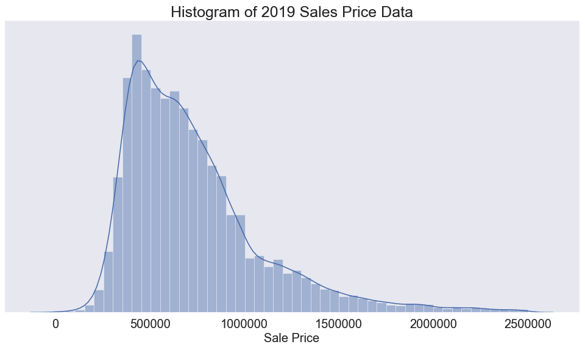
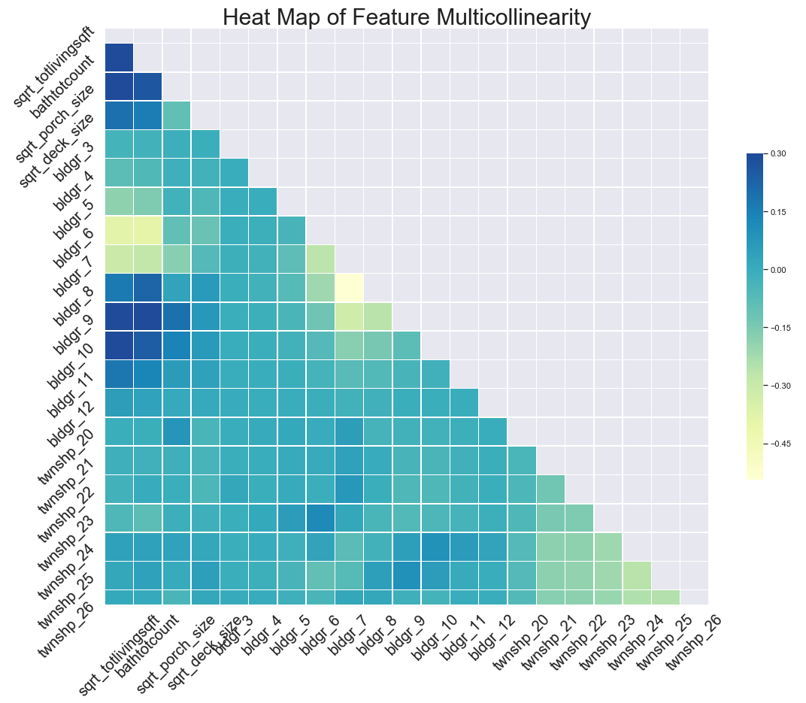
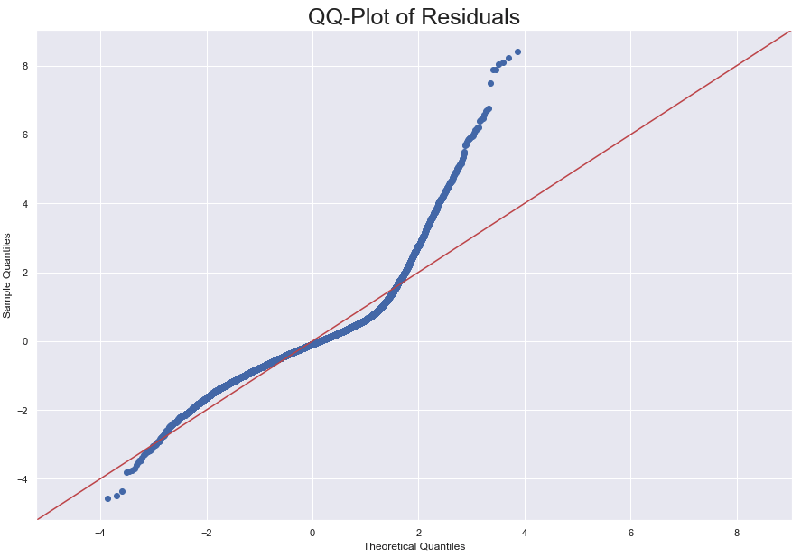
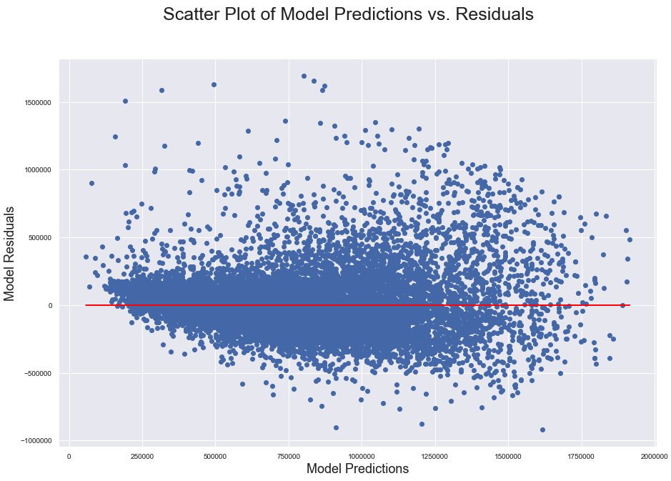
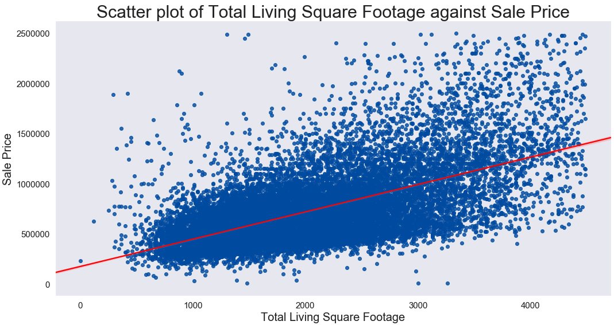
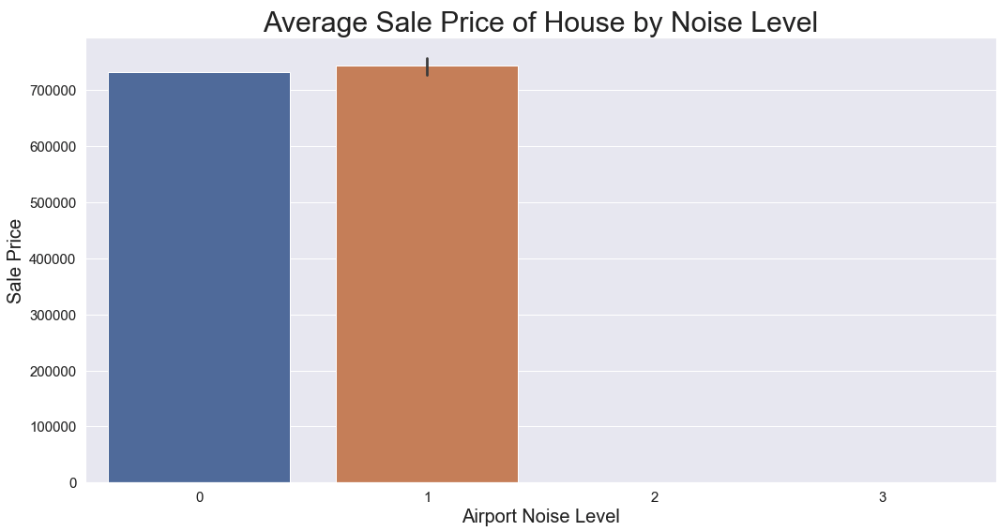
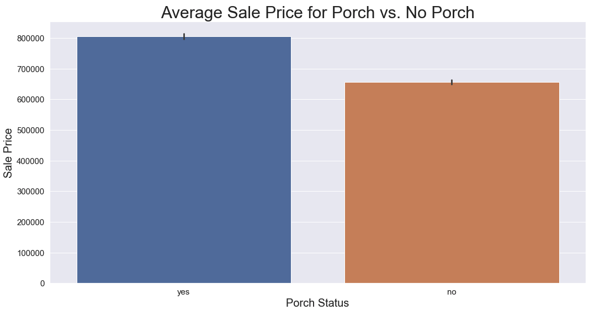

# Analysis and Modelling of King County, WA Home Sale Prices

An analysis and model by Luluva Lakdawala, Amanda Potter and Leana Critchell

## Setting the Scene:

The factors that influence housing prices interest many people, from homeowners hoping to improve the market potential of their current homes, to policymakers making decisions about investment in public projects. Often we rely on the "expert judgement" of real estate professionals to determine which factors are the most important, but these recommendations may be out-of-date, irrelevant to our particular housing market, or otherwise inaccurate.

### Aims:

This project aims to develop a model that predicts housing prices in King County using the features that we identify
For our purposes, we will be creating this analysis for a group of first-time homebuyers in the King County, WA area.  Our group is mostly younger couples who are interested in the long-term investment value in their first home purchase.  In order to get the most ‘bang for the buck’ our home buyers want to understand how features in homes will impact sales price, and especially how to use this information to find properties that are a good value.

In addition, our group of first-time homebuyers has come to us with a lot of questions about so-called ‘expert advice’ they have received since they started to look into purchasing a home.  These claims include:

Higher square footage increases the sale price
Having a porch increase sale price
Homes with a ‘nuisance’ such as power lines, traffic noise, airport noise, etc. will have a lower sales price
This project investigates the factors that determine housing prices in King County, Washington.  Our model and investigation is directed towards first time home buyers who are looking to live in a single family home.  Many factors contribute to real estate sales prices, and we aim to discover what some of these driving factors are. 

### Directory of Repo:
```
├── README.md:  Main README explaining project

├── [exploratory](exploratory)

│   ├── asp_model.ipynb

│   ├── [asp_notebooks](exploratory/asp_notebooks):  Contains Amanda's exploratory notebooks

│   │   ├── [asp_cleaned_final](exploratory/asp_notebooks/asp_cleaned_final)

│   │   └── [asp_working](exploratory/asp_notebooks/asp_working)

│   ├── [get_data_script.ipynb](exploratory/get_data_script.ipynb):  Run this script to download data

│   ├── [ll_notebooks](exploratory/ll_notebooks):  Contains Luluva's exploratory notebooks

│   ├── [lmc_notebooks](exploratory/lmc_notebooks):  Contains Leana's exploratory notebooks

│   ├── [merged_filtered_df](exploratory/merged_filtered_df):  Final collated dataframe used for analysis/modelling

│   ├── [project_requirements.md](exploratory/project_requirements.md):  Contains details of project requirements

├── [reports](reports):  Folder contains final analysis/modeling notebook

│   └── [final_analysis_notebook.ipynb](reports/final_analysis_notebook.ipynb):  Final analysis and modelling

│   └── [images](reports/images):  Contains images from final notebook used in README

└── [src](src)

|   ├── README.MD
    
|    ├── [data](src/data):  contains sql databases which Amanada used for her data gathering.
    
|   │   ├── data_collection.py
    
|   │   ├── [sql](src/data/sql):  Contains sql tables
    
|   │   ├── sql_utils.py
    
|   ├── [data_cleaning](src/data_cleaning):  Contains data cleaning functions
    
|   │   ├── [cleaning_functions.py](src/data_cleaning/cleaning_functions.py):  Functions used for data cleaning
    
|   │   └── create_dfs.py
    
|   └── [modeling](src/modeling):  Contains functions used for modelling
    
|       └── [modeling_functions.py](src/modeling/modeling_functions.py):  Functions used for modelling
```
### Definitions:

- Single family home:
    - A single family home is defined in this project as a single residence on one lot.  Condos are not included in our analysis/model but townhomes are.
- First-time home buyers:
    - Home buyers who are making their first ever home purchase.  We have made the assumption in our analysis that first-time home buyers will not typically buy homes greater than $2.5million 
- Model:
    - The term model referred to through this project is in reference to the linear regression model which we build to explain the variance in home sale prices
- Features:
    - Features refer to the independent variables we choose for our model to help predict sale prices
- Target:
    - Sale Price is our target variable which our model aims to predict

### Data:

The data used in this project is from the King County Department of Assessments website and can be found [here](https://info.kingcounty.gov/assessor/DataDownload/default.aspx).  From this link, you can find the files/tables that were used in this project:
- Real property sales; contains data about the sale of homes in King County
- Residential building; contains details about the buildings in King County
- Parcel; contains details about parcels in King County
- Lookup; contains details about many of the features in the other tables (e.g., sale insturment)

### Methodology
Our analysis began with the full data tables.  We made an initial cut of the data to include the following:
- sales taking place between Jan 1, 2019 and December 31, 2019
- sales of only residential properties, all commercial properties were excluded for this analysis

- Real Property Sales
- Parcel
- Residential Building
- Lookup

Our analysis was only looking at the most recent data from 2019 so the data was filtered to this accordingly. 

Additional information about the table identifiers can be found [here](https://www5.kingcounty.gov/sdc/Metadata.aspx?Layer=parcel#AttributeInfo).

Note that this modelling analysis contains the 'stream lined' version iterations from getting from our first simple model to our final model.  To get a more in depth view of our exploration process, mistakes and tears - I mean - dead ends, please refer to [Leana's](exploratory/lmc_notebooks), [Luluva's](exploratory/ll_notebooks) and [Amanda's](exploratory/asp_notebooks) notebooks.

### Summary of Model:

#### Target:  Sales Price

After filtering our data to be relevant to first time home buyers, we can visualise the histribution of sales prices in King County in 2019:



#### Features:

After many iterations and exploration of the data, the features we chose for our final model were:
- Total living square footage
- Total bathroom count
- Porch size
- Deck size
- Building grade (12 categories)
- Township (7 categories)

We can visualise the relationship between our features in the following heatmap:



Viewing the scale on the side of this image, we can see that the max correlation between the features is 0.3.

#### Assumptions:

Our final model produced an $R^2$ score of 0.702.  While this is somewhat high, we failed to meet the normality assumption and mildly met the homoscedasticity assumption as can be see from the following visualisations:





### Analysis Takeaways, Future Investigations and Recommendations:

- Our analysis finds square footage of total living area, porch and deck, bathroom count, building grade and township to be some of the more significant driving factors of home sale prices.
- We find that a higher square footage does increase home sale prices in King County as can be seen by the linear relationship between the two features here:


- We find that the presence of nuisances has little affect on home sale prices in King County.  More specifically, airport noise, which is the biggest nuisance factor in King County, has litte effect on home sale prices which we can see for the below bar graph (see [final notebook](reports/final_analysis_notebook.ipynb) for full statistical test results):



- We find that having a porch does increase the home sale price in King County which again, we can see in the following bar graph (see [final notebook](reports/final_analysis_notebook.ipynb) for full statistical test results):



#### Further Investigations:

- Is there a large difference in pricing when looking at condominiums?
- What are the drivers of price in the upper bounds of the market?

#### Recommendations:
- Think about buying smaller and adding extension later
- Consider homes without decks/porches and add later to increase value
- Bathrooms are expensive - look for homes that already have the number of baths you desire even at the expense of square footage
